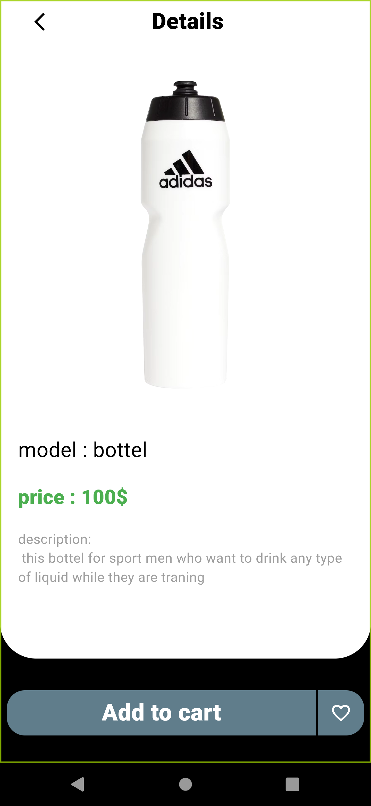

# 🛒 E-Commerce App

## 📝 Description
**E-Commerce App** is a mobile application that allows users to browse products, add them to their favorites, and place orders directly from the app. It’s designed for a seamless shopping experience with an easy-to-use interface.

---

## 🚀 Features
- **Order Placement**: Browse and place orders directly from the app.
- **Favorites**: Save your favorite items to a wishlist for future reference.
- **User-Friendly Design**: Clean and intuitive UI for a smooth shopping experience.

---

## 📸 Screenshots
| Login Screen                                             | Favorites Screen                                             | Home Screen                                             | Details Screen                                             |
|----------------------------------------------------------|--------------------------------------------------------------|---------------------------------------------------------|------------------------------------------------------------|
|  |  |  |  |

---

## 🛠️ Tools & Libraries
- [Flutter SDK](https://flutter.dev)
- [Cubit for State Management](https://pub.dev/packages/flutter_bloc)
- [HTTP for API Integration](https://pub.dev/packages/http)

---

## 🔧 Setup & Installation
1. Clone this repository:
   ```bash
   git clone https://github.com/YourUsername/ecommerce-app.git
